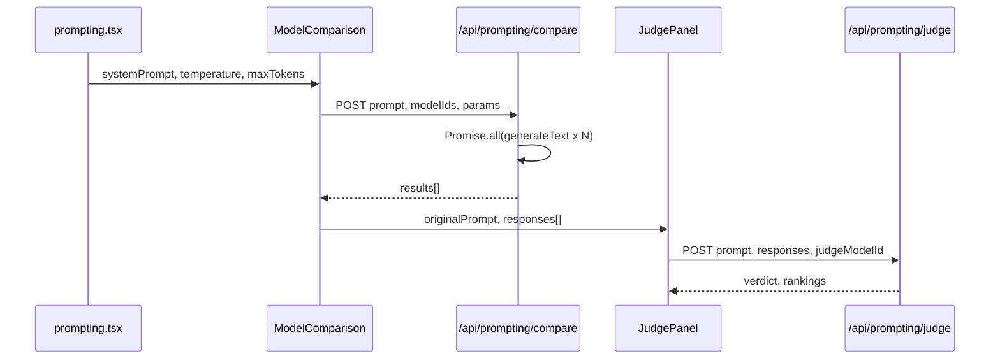

# Spec 2: LLM-as-Judge & Multi-model Comparison

**Date:** 2026-03-27  
**Status:** Draft (ready for implementation)  
**Scope:** Prompting workshop — parallel multi-model runs, side-by-side comparison, optional LLM judge verdict

---

## Overview

Extend the Prompting course page so participants can run the **same user prompt** through **2–4 candidate models** in parallel, inspect outputs side-by-side (with token usage), and optionally invoke a **judge model** that evaluates and ranks those responses. The existing chat flow (`useChat` + `DefaultChatTransport` → `/api/prompting/chat`) stays unchanged; comparison and judging are separate, non-streaming API calls.

**Context:** The app is a Next.js AI workshop focused on movie/TV discovery. Today, `src/pages/prompting.tsx` offers a single chat model, system prompt editor (with presets), temperature/max tokens, streaming chat, and `UsageStats` on assistant messages.

## Decisions

| Decision | Choice |
|----------|--------|
| Placement | New **Model Comparison** section on the prompting page, **below** the existing two-column layout (sidebar + Chat card), full width. |
| Workshop UI language | **English** for labels, buttons, placeholders, errors (aligned with Spec 1). |
| Theory / Teori language | **Norwegian** for new exercise copy in `PromptingTheory`. |
| Candidate models | **2–4** models selected from `LANGUAGE_MODEL_OPTIONS` (`src/lib/model-selectors.ts`). |
| Execution model | **Parallel** requests with `Promise.all`; each completion uses **`generateText`** (not streaming) so all texts are available before judge step and for stable side-by-side display. |
| Compare API | **`POST /api/prompting/compare`** — JSON in, JSON out. |
| Judge API | **`POST /api/prompting/judge`** — accepts prompt + candidate outputs + judge model; returns verdict text + structured rankings. |
| Shared parameters with chat | Compare uses the **same** `systemPrompt`, `temperature`, and `maxTokens` as the workshop controls (read from existing page state) unless we later split controls (out of scope). |
| Judge system prompt | **Server-defined** template that injects user prompt and candidate outputs; optional short editable field is out of scope unless needed later. |

---

## 1. UI layout — Model Comparison section

### Location

- Render **after** the closing `</div>` of the main `grid` (`grid-cols-1 lg:grid-cols-[380px_1fr]`) so the section spans the full content width under both the left column and the Chat card.
- Wrap in a **`Card`** titled **"Model Comparison"** for visual consistency with Model / System Prompt / Parameters / Chat.

### Controls (top of card)

1. **Candidate models** — Multi-select of 2–4 items from `LANGUAGE_MODEL_OPTIONS` (labels as shown in the existing single-select). If the design system has no multi-select, use a **popover + checkbox list** or **multi-select** primitive consistent with shadcn patterns used elsewhere.
2. **Comparison prompt** — Single-line or short **textarea** for the user message to send to every candidate (not the full chat transcript). Placeholder in English, e.g. *"Enter the prompt to run on all selected models…"*.
3. **Run Comparison** — Primary button; disabled when fewer than 2 models, empty prompt, or a compare request is in flight.

### Results (after success)

- **Responsive grid** of **side-by-side cards** (e.g. 1 col mobile, 2 cols tablet, up to 4 cols desktop). Each card shows:
  - **Model name** (from `LANGUAGE_MODEL_OPTIONS` label for `modelId`).
  - **Response text** (`whitespace-pre-wrap`, scroll if long).
  - **`UsageStats`** with `promptTokens`, `completionTokens`, and `modelId` for cost display; **tokens/s** can be omitted or computed from client timing if we want parity with chat (optional — spec prefers showing at least input/output tokens from `generateText` usage).

### Judge subsection (bottom of same card or nested card)

- **Heading:** "Judge" (English).
- **Judge model** — Single select from `LANGUAGE_MODEL_OPTIONS` (same list as chat; default e.g. `DEFAULT_LANGUAGE_MODEL`).
- **Run Judge** — Disabled until compare results exist, or while judge request is in flight.
- **Verdict** — Card or bordered region showing evaluation **prose** plus optional compact summary of **rankings** (model name + rank + short reasoning) if returned structured.

### Loading and errors

- Compare: show **per-slot loading** or a single spinner + disable button; on partial failure, show error on failed cards and success on others (implementation detail: API may return per-model errors).
- Judge: inline error alert; retry via **Run Judge** again.

---

## 2. Component design

### `ModelComparison`

**Responsibility:** Own UI state for candidate `modelIds`, comparison `prompt`, compare loading/results, and orchestration of `fetch` to `/api/prompting/compare`.

**Suggested location:** `src/components/prompting/ModelComparison.tsx` (new folder keeps prompting-specific UI grouped).

**Props (minimal):**

```typescript
interface ModelComparisonProps {
  systemPrompt: string;
  temperature: number;
  maxTokens: number;
}
```

**State:**

- `selectedModelIds: LanguageModelId[]` (enforce 2–4 in UI validation).
- `comparePrompt: string`.
- `compareStatus: "idle" | "loading" | "success" | "error"`.
- `compareResults: Array<{ modelId: LanguageModelId; text: string; usage: { inputTokens: number; outputTokens: number } }>` (align field names with AI SDK / existing `UsageStats` props).
- `compareError: string | null`.

**Behavior:**

- On **Run Comparison**, `POST /api/prompting/compare` with body matching API contract below.
- Pass `compareResults` and the original **user comparison prompt** to `JudgePanel`.

### `JudgePanel`

**Responsibility:** Judge model picker, run judge action, display verdict.

**Suggested location:** `src/components/prompting/JudgePanel.tsx`.

**Props:**

```typescript
interface JudgePanelProps {
  originalPrompt: string;
  responses: Array<{ modelId: LanguageModelId; text: string }>;
}
```

**State:**

- `judgeModelId: LanguageModelId`.
- `judgeStatus`, `judgeResult`, `judgeError`.

**Behavior:**

- **Run Judge** calls `POST /api/prompting/judge` with `prompt`, `responses`, `judgeModelId`.
- Render `verdict` as main text; render `rankings` as a short ordered list or table under the verdict.

### Page integration (`src/pages/prompting.tsx`)

- Import `ModelComparison` and render it below the grid, passing `systemPrompt`, `temperature`, `maxTokens` from existing state.

---

## 3. API routes

### `POST /api/prompting/compare`

**Purpose:** Run one user message against N models in parallel with the same system prompt and generation parameters.

**Request body (JSON):**

```typescript
{
  prompt: string;           // single user message
  systemPrompt?: string;
  modelIds: LanguageModelId[];  // length 2–4, validated server-side
  temperature?: number;
  maxTokens?: number;
}
```

**Implementation notes:**

- Validate with **Zod** (extend `src/lib/chat-api-schemas.ts` or add `prompting-compare-schema.ts`).
- For each `modelId`, call `generateText` from `ai` with `getModel(modelId)` (`src/lib/openai.ts`), same patterns as `/api/prompting/chat` (system prompt default can match chat route’s `defaultSystemPrompt`).
- `Promise.all` over model calls; map results to a uniform shape.

**Response (JSON):**

```typescript
{
  results: Array<{
    modelId: string;
    text: string;
    usage: { inputTokens: number; outputTokens: number };
  }>;
}
```

**Errors:** Use existing `validateRequest` / HTTP error patterns; optionally return 200 with per-item errors if we want partial success (document choice at implementation time).

### `POST /api/prompting/judge`

**Purpose:** Send candidate outputs to a judge model with a **fixed server-side system prompt** that instructs the model to compare answers for the movie/TV recommendation task, output a **verdict** (narrative) and **rankings** (structured).

**Request body (JSON):**

```typescript
{
  prompt: string;  // the same comparison prompt the candidates answered
  responses: Array<{ modelId: string; text: string }>;
  judgeModelId: LanguageModelId;
}
```

**Response (JSON):**

```typescript
{
  verdict: string;
  rankings: Array<{
    modelId: string;
    rank: number;       // 1 = best
    reasoning: string;  // brief
  }>;
}
```

**Implementation notes:**

- Prefer **`generateObject`** (or equivalent) with a Zod schema for `{ verdict, rankings }` so rankings are reliable; fallback narrative-only is weaker for the workshop.
- User content should include the original prompt and each model’s answer, clearly labeled by `modelId` / human label to avoid ambiguity.
- Do not send full chat history from the main chat — only the comparison prompt and candidate texts.

---

## 4. Data flow



- **Chat path** remains: `useChat` → `/api/prompting/chat` → `streamText` (unchanged).
- **Compare path** is independent; no requirement to sync compare prompt with chat `input`.
- **Judge path** depends only on latest successful compare results in the client.

---

## 5. Files changed / created

| Path | Action |
|------|--------|
| `src/pages/prompting.tsx` | Import and render `ModelComparison` below the main grid; pass shared params. |
| `src/components/prompting/ModelComparison.tsx` | **Create** — candidate multi-select, prompt field, Run Comparison, result grid, embed or compose `JudgePanel`. |
| `src/components/prompting/JudgePanel.tsx` | **Create** — judge model select, Run Judge, verdict UI. |
| `src/app/api/prompting/compare/route.ts` | **Create** — parallel `generateText`, JSON response. |
| `src/app/api/prompting/judge/route.ts` | **Create** — judge `generateObject` + schema. |
| `src/lib/chat-api-schemas.ts` (or sibling) | **Extend** — Zod schemas for compare and judge bodies. |
| `src/components/theory/PromptingTheory.tsx` | **Update** — add exercises 7–9 (Norwegian). |

---

## 6. Out of scope

- Streaming partial tokens for compare (non-streaming only).
- Using compare/judge from other course pages.
- Persisting comparison history or server-side logging beyond normal app patterns.
- Editable judge system prompt in the UI (server template only unless product asks).
- Automatic exclusion of "no tools" models from judge/candidate lists (participants may still pick them; failures surface as errors).
- Changing the main chat to multi-model or merging chat transcript into compare.

---

## 7. PromptingTheory — new exercises (Norwegian)

Add three numbered items **after** the existing six items in the **Oppgaver** list inside `PromptingTheory`:

7. Legg til modeller som modellkandidat  
8. Kjør samme prompt på flere modeller — sammenlign selv, hvilken var best?  
9. Bruk LLM as judge — var du enig med dommen?

Optionally add a short **Konsepter** bullet (Norwegian) explaining *modell-sammenligning* og *LLM som dommer* i én–to setninger, hvis det hjelper deltakerne — ikke påkrevd for MVP.

---

## 8. Acceptance checklist (implementation)

- [ ] 2–4 models enforced in UI and validated on the server for `/api/prompting/compare`.
- [ ] Compare runs complete in parallel; side-by-side cards show text + `UsageStats` (min. token counts + model for pricing).
- [ ] Judge runs only after successful compare; verdict and rankings visible.
- [ ] Workshop strings remain English; new theory exercises are Norwegian.
- [ ] Existing chat streaming behavior unchanged.
